# Inky Paper V1 · 第二轮视觉细化

日期：2026-09-08。直接修改当前 Figma 文件，保留产品结构；最新专注反馈增量扩展结束卡高度并增加选填分支，其他页面延续原有尺寸与流程。

## 追加：专注结束反馈与数据边界

后续范围以文末「Inky 呈现与采集」为准：复杂对话和决策交给 Hermes，Inky 仅呈现行动并采集执行事实。

- 更新 3 处本轮结束卡：27:573、4:111、3:64。默认 320 × 320，标题改为“这一轮，结束了”，显示本轮计时摘要，明确区分“任务完成了”与“这一轮先到这里”。再专注与休息入口保留。
- “补一句（选填）”打开 320 × 520 的展开态：95:23（第一件任务）、97:23（主线）。产出、卡点、下次起点全部可跳过；使用复用横线字段组件 96:2。字段文案是占位示例，不是已经采集的记录。
- 完成出口保留原有 76:26 / 76:3 的铅笔划线动效。先到这里分别返回 21:184 / 4:2，保持任务未完成。收起补充返回对应简版。
- 画布交付说明 100:32 区分自动字段、选填字段与实现边界。产品应自动记录会话和任务 ID、计划时长、计时累计时长、起止时间及退出方式；已有数据可复用，逐次暂停／恢复和结果事件仍需开发。任务完成由明确操作决定，不由计时结束推断；计时不等同有效产出。选填内容关联 sessionId，空值保留未知，收起不丢草稿，重复提交不重复写入，保存失败保留草稿。
- 验证：浏览器点通 27:573 → 95:23 → 21:184，确认不填写也能返回且任务仍待办；27:573 → 76:26 → 27:596，确认完成后的划线状态。检查简版、展开版、专注展板与交付说明截图，布局无越界，文字为 Noto Sans SC；343 个含交互节点、88 个导航目标，无失效目标。迷你宠物未修改。
- 边界：本轮仅更新 Figma 和设计记录，输入框不支持真实输入或存储；未修改应用代码、数据库或 Obsidian。精力评分和健康同步不在本轮范围。

[体验反馈卡](https://www.figma.com/proto/Uhb9FJXS6MC2bxeFjIdpjs?node-id=27-573&starting-point-node-id=27%3A573&scaling=actual-size) · [展开设计](https://www.figma.com/design/Uhb9FJXS6MC2bxeFjIdpjs?node-id=95-23) · [数据边界说明](https://www.figma.com/design/Uhb9FJXS6MC2bxeFjIdpjs?node-id=100-32)

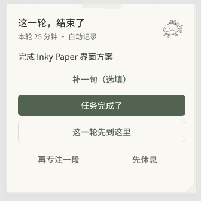
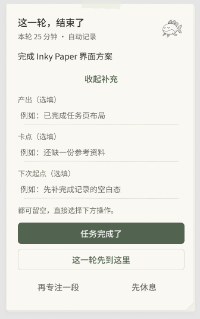
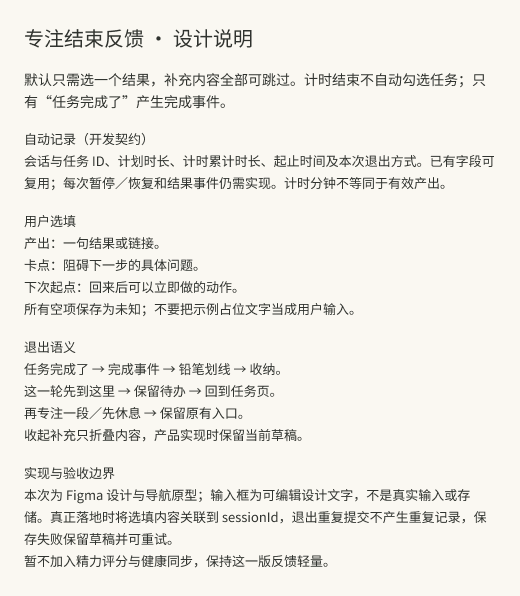

## 追加：纸边、接触阴影与收纳恢复

本节为最新增量，覆盖下方早期版本的阴影参数与对应返回连接。

- 94 处可见工作纸统一为暖灰 0.6 px 内描边，并使用两层接触阴影：y=1、blur=1.5、alpha=0.065；y=4、blur=10、alpha=0.035。94 处底纸使用 0.5 px 浅描边，无阴影。19 处便签使用 y=1、blur=2、alpha=0.09 与 y=3、blur=6、alpha=0.045 的轻厚度阴影。纸纹强度保持不变。
- 完成反馈在点击“回到任务”后，纸页轻微收拢 160 ms，停留 60 ms，再以 120 ms 淡出进入原目标。两条中间状态为 84:2 → 4:189、84:26 → 22:182。完成结果不会自动收起，用户可以先阅读。
- 完成记录点击“重新打开任务”后，进入 84:49，以 180 ms 淡去划线并恢复正文墨色，停留 60 ms，再以 120 ms 淡入原待开始页 21:184。空记录占位不添加划线或恢复动效。
- 浏览器实际点通：27:596 → 84:26 → 22:182 → 22:91 → 84:49 → 21:184。最终页面任务文字无划线，可继续“进行任务”。已核对过渡状态与最终画面，未逐帧测量动画时长。
- 结构校验：新增动效状态无非绝对定位子节点越界；324 个含交互节点的 85 个导航目标均存在；19 个迷你态仍只有透明背景宠物。本轮仅更新 Figma 与交付记录，未修改桌面应用代码。

[体验收纳与恢复](https://www.figma.com/proto/Uhb9FJXS6MC2bxeFjIdpjs?node-id=27-596&starting-point-node-id=27%3A596&scaling=actual-size)

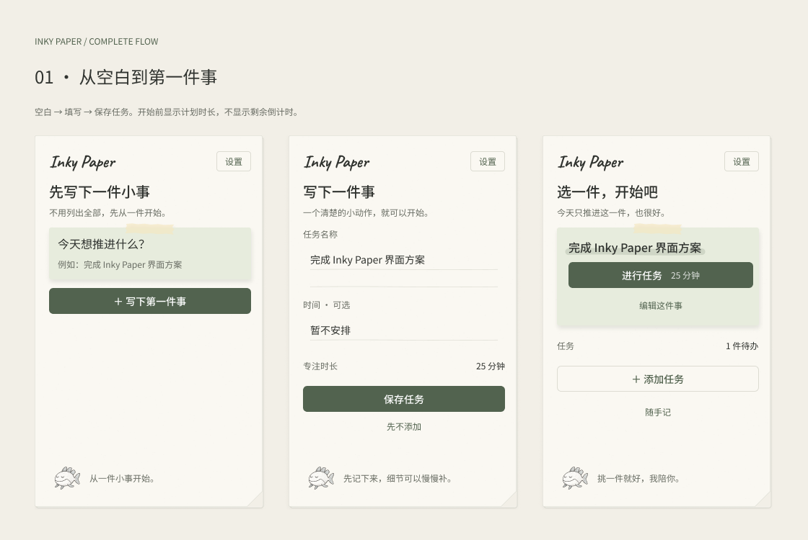

## 追加：纸上完成划线

已在完成记录和任务收好反馈中同步 5 处铅笔划线（包含展板副本）。复用现有铅笔曲线，线宽 1.1 px、透明度 0.62，长度跟随文字，文字改为 muted 色。完成记录卡片使用纸色。空记录占位、待办、暂停、番茄钟结束状态均不加划线。初版检查 5 条线均在父容器内、原型连接数量 297；后续新增的动效见下一节。

## 追加：书写、标记与划掉

- 12 处当前任务标题加入淡色笔迹，复用既有铅笔曲线，sageInk 色、9 px 笔宽、0.16 透明度，放在文字后方。
- 20 个任务/时间/下一步/AI 原文输入区改为横线纸：24 px 行距，细线位于文字基线下方，保留原字段和按钮。9 处随手记已有横线同步线宽与颜色。AI 密钥输入框保留原样。
- 20 个书写字段加入点击聚焦预览：当前字段横线加深，同一页面其他字段恢复浅线。Figma 示例内容仍不是真实文本输入。
- 完成划线已加入两条真实原型路线：4:121 → 76:3 → 11:540；27:588 → 76:26 → 27:596。起笔状态等待 60 ms，以 250 ms Smart Animate 将裁切容器从 0.01 px 展开到 166 px，笔迹本身保持宽度，形成从左到右显露；文字同时淡化。点击“回到任务”仍使用原目标。
- 浏览器实际验证：完成按钮进入起笔状态，自动到达已划线完成页；任务名称点击后底线加深，切换到时间字段后原字段恢复；保存按钮仍进入待开始页。未对 250 ms 动画进行逐帧时序测量。
- 校验：新增 43 处笔迹/横线无越界，修改字段文字无越界；321 个含交互节点的 82 个导航目标均存在；19 个迷你态仍只有透明背景宠物。

[播放完成动效](https://www.figma.com/proto/Uhb9FJXS6MC2bxeFjIdpjs?node-id=27-573&starting-point-node-id=27%3A573&scaling=actual-size)

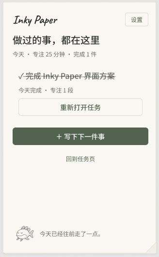
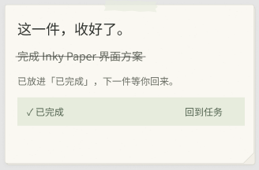

## 查看

- [任务主界面](https://www.figma.com/design/Uhb9FJXS6MC2bxeFjIdpjs?node-id=2-8)
- [空白、添加与待开始](https://www.figma.com/design/Uhb9FJXS6MC2bxeFjIdpjs?node-id=30-2)
- [专注与透明迷你宠物](https://www.figma.com/design/Uhb9FJXS6MC2bxeFjIdpjs?node-id=3-2)
- [原型起点：待开始](https://www.figma.com/design/Uhb9FJXS6MC2bxeFjIdpjs?node-id=21-184)

## 已修改

- 字体：品牌 Caveat Bold 24/32；页面标题 Noto Sans SC Medium 20/28；主任务 16/24；主按钮 14/20；辅助文字 12/18；专注数字保留 DM Sans 34/40。
- 操作：初次启动显示“进行任务”，时长单独作为按钮中的轻量辅助文字。编辑、返回、取消等操作降低视觉权重。主按钮统一 36 px 高、6 px 圆角；专注暂停/继续保留紧凑规格。
- 布局：保留主页面 20 px 外边距；标题与说明间距 6 px；表单标签与字段间距 4 px。陪伴页脚统一在 500 px 基线，宠物 48 px。少数密集状态使用 8 px 分组间距。
- 纸张：细纤维透明度由约 0.095 降至 0.045；隐藏重复底页和便签内折角；工作纸阴影调整为 y=2、blur=6、alpha=0.055。专注卡隐藏胶带与折角，保留任务便签胶带。
- 宠物：专注页宠物移至页边，尺寸 32 px。19 个迷你状态只显示宠物，框架无填充、描边或阴影，其余装饰与状态文字隐藏。95 处宠物画面统一使用真实透明素材。
- 过渡：页面跳转统一 180 ms 淡入；暂停/继续为 120 ms 淡入。保留全部原型目标与状态关系。

## 验证与边界

- 检查 83 个 320 px 页面/状态，包含展板副本；自动布局容器无越界子节点，页面无越界文字。
- 297 处原型连接的 80 个目标均存在。
- 主流程：21:264 → 27:485（进行任务 → 独立专注）；27:493 → 27:551（收起）；27:551 → 27:485（恢复专注）。
- 已目视检查任务、专注/迷你、设置/随手记、AI、任务管理的导出画面，并对照修改前截图。
- 透明素材为 RGBA，透明像素约 55.7%；19 个迷你框架仅有宠物可见。Figma 展板截图是预览，应用应使用下面的透明源素材。
- 本次交付是 Figma 视觉稿和原型连接更新，未修改桌面应用代码。原生窗口透明、键盘焦点、真实计时与保存未进行运行测试。
- 按钮 hover、按下位移、减少动态效果与宠物动作尚未制作成交互组件：开发时分别采用约 120 ms 颜色反馈、最多 1 px 按下位移，以及减少动态效果时禁用位移；专注期间不加入持续宠物动画。

## 追加：Inky 呈现与采集 · Hermes 对话

本轮在原文件新增独立的「执行」示例分支，复用现有纸页、铅笔鱼、字体与配色。未新增精力评分、任务推荐榜单或分析页面，也未修改桌面代码。

- 任务页 108:32：突出「列出任务页的 3 个关键状态」，弱化显示所属任务「完成 Inky Paper 界面方案」；手动修改 108:135，开始后进入独立专注 108:69。
- 暂停页 108:102：保留计时、继续入口，增加可选「回来先做什么」。110:171 为已有恢复线索的示例状态；没有记录时不编造提示。恢复页是独立设计状态，当前原型不模拟真实输入与保存。
- 本轮结束 110:37 与选填展开 110:65：采集产出、卡点、下次起点；「这一步完成了」进入 110:113，只划掉当前步骤，返回 110:133 后所属任务仍为待办；「这一轮先到这里」保持原下一步。
- 新增专注／暂停／待开始／步骤完成后／恢复线索页的 5 个透明迷你状态，分别返回对应上下文；明确休息页 113:94 保留结束休息与返回任务入口。
- Figma 交付说明 114:52 区分显示内容与后台采集：稳定 taskId/actionId/sessionId、来源与执行版本、任务修改／完成／重新打开事件、专注与明确休息起止、逐次暂停／恢复／结束、累计计时；产出、卡点、恢复线索、简短感受可选。精力、可用时间、推荐解释和取舍由 Hermes 对话承接，不重复询问。

验证：检查 16 个新增画面（含说明）无自动布局子节点越界，复用 Caveat / Noto Sans SC / DM Sans；5 个新迷你态仅铅笔鱼可见，根节点无填充、描边或阴影；全文件 103 个导航目标均存在。浏览器实际点通 108:32 → 108:69 → 108:102 → 110:37 → 110:113 → 110:133。输入、计时、Hermes 同步和数据采集仍为待实现能力，不能将原型显示的示例当作运行数据。

[执行原型](https://www.figma.com/proto/Uhb9FJXS6MC2bxeFjIdpjs?node-id=108-32&starting-point-node-id=108%3A32&scaling=actual-size) · [已有恢复线索](https://www.figma.com/design/Uhb9FJXS6MC2bxeFjIdpjs?node-id=110-171) · [呈现与采集说明](https://www.figma.com/design/Uhb9FJXS6MC2bxeFjIdpjs?node-id=114-52)

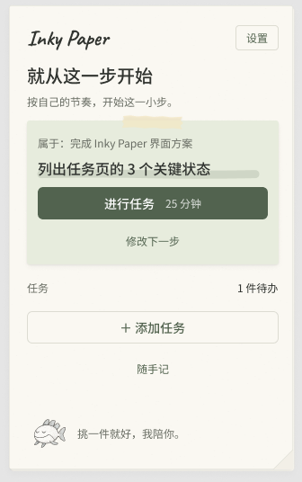
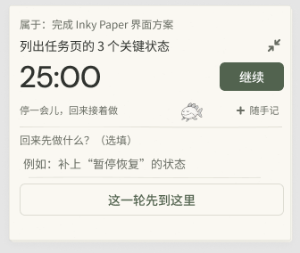
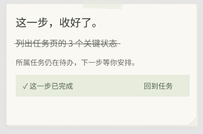
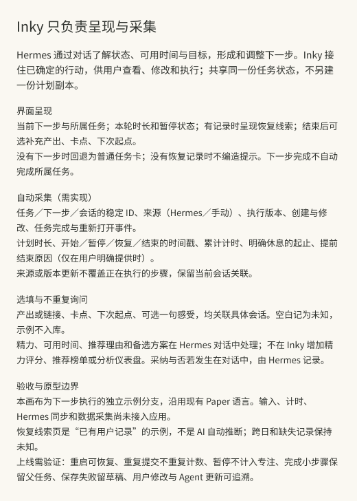

## 透明宠物素材

透明宠物：[inky-paper-mascot-v2-transparent.png](../inky-paper-mascot-v2-transparent.png)。原始宠物素材保留。

使用内置图像编辑工具，从原宠物图去除外部纸色背景。最终提示词：

> Background removal cutout. Keep the provided pencil fish identical. Output RGBA PNG with transparent alpha background. Remove all paper outside the silhouette including around all fins. No checkerboard, no grid, no white rectangle. Fish body white, pencil shading preserved. Actual transparent background.

## 最终预览

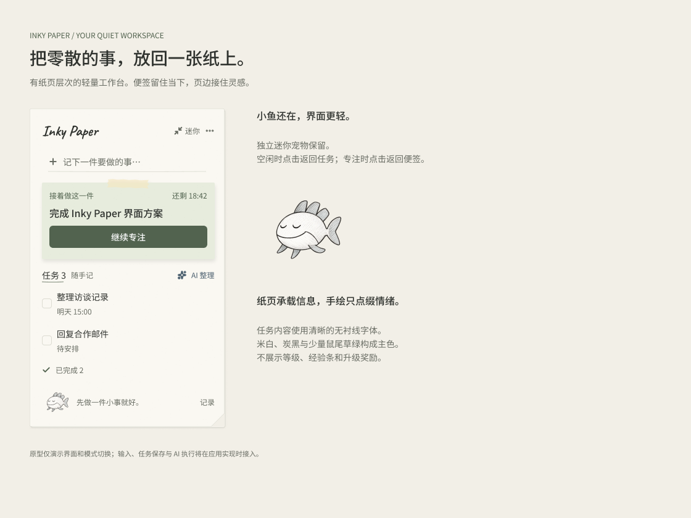
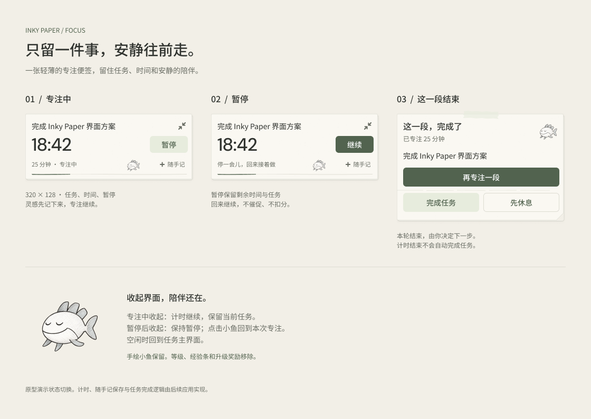
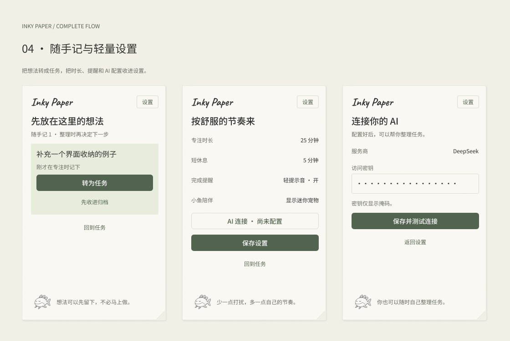
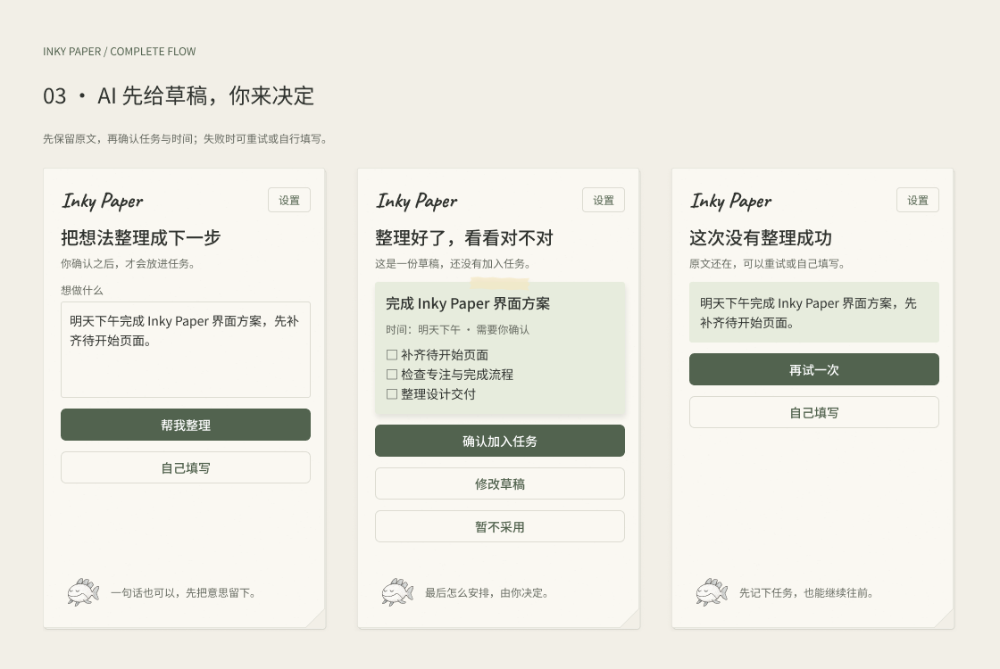
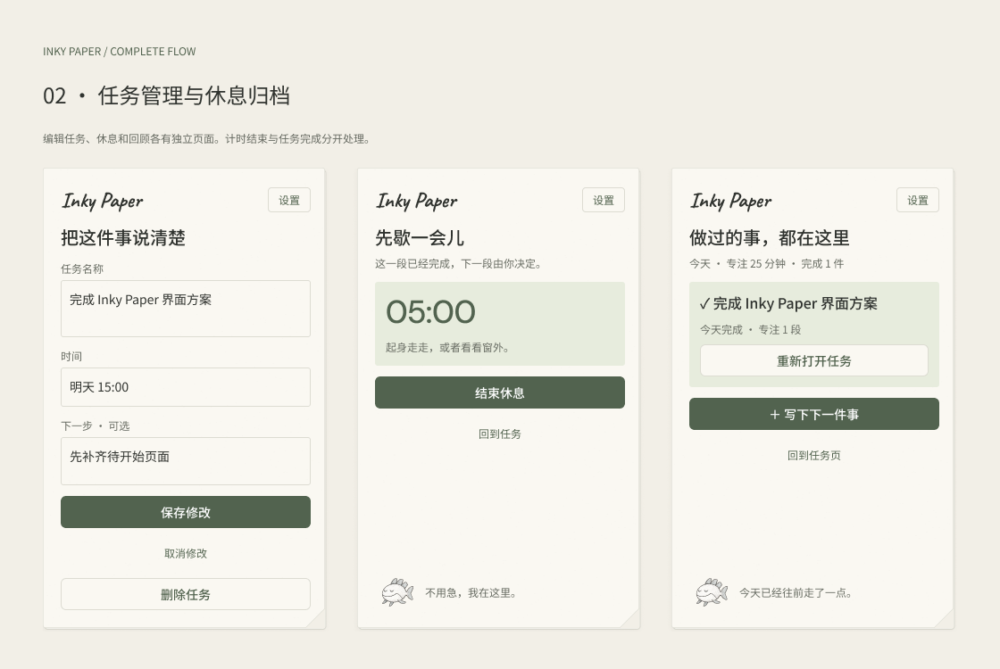
