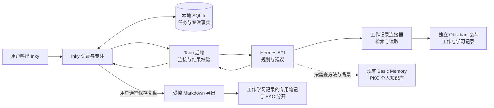

# Inky：接入 Hermes 的轻量个人工作助手方案

2026-09-06 需求更新：用户已明确要求“在 Hermes 或其他 Agent 中交流，计划和进度主要呈现在 Inky，双方都能修改”。最新主流程见 [Agent 驱动的 Inky 使用方案](2026-09-06-agent-driven-inky-usage.md)。本文件保留前一阶段设计记录；其中“Agent 只读”“由 Inky 发起建议”的限制已被新方案替代。工作资料读取与 Markdown 单向导出仍可保留，但不能替代 Agent / Inky 对任务的共同读写。

日期：2026-09-05。状态：调研与设计提案，尚未实现。本文基于当前源码、现有 Vault 的结构与接入文档，以及其他项目的官方资料。未启动 Inky 做桌面验收，未调用 Hermes 模型，未修改 Hermes 配置或 Vault 内容。

建议将 Inky 定位为：一个随时能叫出来、知道当前工作与学习背景、帮助开始下一步的桌面助手。工作与学习记录保存事实和进度，Hermes 理解资料并给建议，Inky 负责记录、选择和执行。

用户已明确：PKC Vault 是个人知识库，不是工作和学习记录；工作学习使用另一个 Obsidian 仓库，目前还没有对应数据。本方案因此从零设计工作学习数据，具体路径留待接入时选择。不能因为 PKC 已接入 Hermes，就把 PKC 当作默认工作记录来源或写入目标。

“轻量”同时指低视觉存在感、少操作和低后台开销。功能增加应发生在检索、建议和记录能力上，主界面始终围绕当前一件事。

## 已核查的基础与缺口

| 范围 | 本次核查结果 | 对下一步的影响 |
|---|---|---|
| Inky 源码 | `058d92a`，版本 `0.1.2`；已有任务、子任务、Inbox、专注历史、回到任务提示、托盘和 Alt+F | 可复用已有执行流程；源码存在不代表本轮已验证运行效果 |
| 当前窗口 | 默认 300×520、置顶；另有 240×136 专注模式及 160×160 迷你模式 | 小型模式已有基础，但托盘优先、无打扰策略还需实现 |
| 当前 AI | 单任务解析与拆解；未找到 Hermes、Obsidian 的接口 | 需要增加工作上下文和 Hermes 连接层 |
| Hermes 本地源码 | `63279301bc`，`0.21.0`；有 API Server、流式响应和按平台配置工具的代码 | 可作为后台，不必把 Hermes 桌面界面嵌进 Inky |
| Hermes 默认 API | 本次访问 `127.0.0.1:8642/health` 被拒绝连接 | 只能确认该默认地址没有响应；不能推断其他端口或 Hermes 所有进程状态 |
| PKC Vault | Obsidian 注册信息中该 Vault 为打开状态；接入文档记录 Hermes + Basic Memory 已配置；用户确认它是个人知识库 | 只作为可选知识参考；不能作为今日工作事实或日常记录的默认存放处 |
| 工作与学习记录 | 用户明确使用另一个 Obsidian 仓库，当前还没有对应数据 | 从少量目标与执行记录开始积累；无需迁移 PKC |

PKC Vault 当前路径：`C:\Users\31009\Documents\Codex\2026-09-03\referenced-chatgpt-conversation-this-is-an\PKC-Vault`。该路径只标识已存在的个人知识库，不代表工作数据路径。

已有代码还保留三条示例任务、初始 10 XP、固定连续天数，以及输入超过 8 个字符触发 AI 的路径。接入工作建议之前，应隔离演示数据并让普通记录立即保存，避免这些内容进入真实规划。

## 参考项目及具体借鉴

以下产品能力来自官方资料；“用于 Inky”是本方案的设计判断，没有对这些产品做本机性能比较。

| 参考 | 官方描述的相关能力 | 用于 Inky |
|---|---|---|
| [Raycast Notes](https://www.raycast.com/core-features/notes) | 快捷键呼出浮动笔记，快速捕获，键盘操作 | 记录入口一步打开，保存后回到工作；借鉴交互方式，不假设其各平台功能完全一致 |
| [Sunsama Daily Planning](https://help.sunsama.com/docs/usage-guides/daily-planning/) | 回顾昨日、选当天任务、检查预估负荷、排列计划 | 今日建议最多三项；用可用时间限制任务量，允许随时调整 |
| [Khoj](https://docs.khoj.dev/features/chat/) / [Obsidian 客户端](https://docs.khoj.dev/clients/obsidian/) | 检索个人笔记、引用来源、限制回答使用的文件范围 | 每个建议显示依据，点击能回到原笔记；复用 Hermes 已有记忆能力，无须另加 Khoj 后台 |
| [Super Productivity](https://github.com/super-productivity/super-productivity) | 任务、时间盒、用时记录、工作总结，以及任务关联笔记和文件 | 把“计划—专注—完成—复盘”连起来；首版不引入完整项目管理界面 |
| [ActivityWatch](https://docs.activitywatch.net/en/latest/watchers.html) / [FAQ](https://docs.activitywatch.net/en/latest/faq.html) | 活动窗口与离开电脑检测，数据在本机保存 | 后期可选读取应用级时长汇总，为复盘补充背景；窗口停留时间不能当作工作成果或效率评分 |

## 五个相关功能

| 优先级 / 功能 | 使用情境 | 数据与输出 | 如何保持轻量 |
|---|---|---|---|
| P1 今日计划 | 开始工作或学习，尚未决定先做什么 | 根据工作项目/学习目标、明确截止时间、未完成任务、当日可用时间，建议最多三项；显示理由及估时 | 主动点击生成；内容折叠为下一项，必要时才展开完整计划 |
| P1 下一步建议 | “我只有 20 分钟”或“不知道怎么开始” | 给一个可执行动作、所需资料、依据；用户可修改、采纳、跳过 | 一张建议卡；采纳后复用任务与专注流程 |
| P1 快速收集 | 工作中突然想到另一件事 | 先存到 Inky Inbox；后续可关联项目或导出到 Vault Inbox | Enter 本地保存，不等待 AI；来源不明时保留普通记录 |
| P1 中断恢复 | 开会、休息或临时切换后回来 | 展示上次任务、做到哪里、下一小步、相关笔记 | 优先使用本地状态和用户留的一句话；不必每次调用模型 |
| P2 收工复盘 | 结束一天 | 从已完成任务、专注记录、用户补充产出整理完成事项、阻塞与明日起点；学习可记录练习结果、疑问与下次起点 | 点击生成可编辑草稿；保存到独立工作学习记录源，反馈“已保存”或明确失败 |

项目笔记引用可以随这些功能一起提供。日历只读接入、ActivityWatch 汇总、周复盘和语音捕获属于后续可选扩展。自动改期、全天监听和完整聊天历史工作台不纳入第一版。

示例：用户说“下午只剩 40 分钟”。Inky 从当天任务取得剩余事项，Hermes 检索相应项目笔记，建议“先用 25 分钟列出报告的三个结论”，注明引用的目标和截止日期。用户点“开始 25 分钟”后进入专注；完成后可把真实产出链接加进复盘。这个例子是设计情境，不是对用户实际工作的推断。

## 低存在感的界面

当前未收到外观选择的回复，先按“托盘优先”设计；桌面小浮点和小桌宠保留为可选偏好。

| 状态 | 拟议表现 | 操作 |
|---|---|---|
| 平时 | 默认仅托盘图标；启动不弹出大窗口，不强制命名宠物 | Alt+F 呼出，并直接聚焦输入；快捷键允许更改 |
| 呼出 | 紧凑面板：输入、当前建议、折叠的今日计划 | 记录用 Enter；Esc 保存输入草稿并收起；建议有“依据”和“开始” |
| 专注 | 可选小浮条，仅任务名、剩余时间、暂停；也可只留托盘 | 点击展开；隐藏后继续正确计时 |
| 桌宠 | 可选小桌宠，默认静止，交互时才短暂反馈 | 点击呼出；不自动弹聊天气泡或强制成长提示 |
| 建议与提醒 | 在呼出面板中等待查看；专注中不主动弹出建议 | 每日计划/收工提示由用户启用时段；同一事件去重，支持暂缓 |

轻量界面的目的不是把所有文字缩小。当前按钮和输入仍应清晰易点，低对比只用于次要装饰，完整键盘操作需要保留。

系统空闲只表示暂时没有键鼠输入，可能正在读文档或思考。中断恢复应提示“继续上次这一步”，不据空闲时间断言用户走神。

## 接入结构

Hermes 官方 API 已提供 Chat Completions、Responses 和工具进度流，可由其他前端调用。Inky 首版可从一次请求返回一份建议开始，再加流式进度。具体以本机运行实例的能力检查为准。[Hermes API 文档](https://hermes-agent.nousresearch.com/docs/user-guide/features/api-server/)

本地 API 由 Tauri 后端调用，连接凭据保留在后端。优先连接已有 Hermes gateway；不为每次点击启动 Hermes Electron 桌面，不在 Inky 再运行一个向量索引。API 不在线时，记录和计时继续可用，面板提供重新连接入口。

工作记录若也是 Markdown，先用选定目录的读取与简单检索跑通；内容量需要索引时再注册独立项目。不要更改现有 `pkc-vault-phase1` 的全局默认配置来路由工作请求。每次请求明确工作记录源；Basic Memory 多项目选择以及 API 会话如何加载该配置，列为接入验收项。若当前 provider 无法可靠按请求选择项目，使用独立连接器或配置实例，不将两个库混入一个索引。

Hermes API 会在服务端执行其工具；“返回结果以后由 Inky 确认”不能阻止已经发生的工具写入。建议模式必须实际限制可用工具为所需检索/读取能力；不能只加一句“不要写文件”的提示词。当前源码存在 `api_server` 平台工具配置，但 Basic Memory 插件的具体读写工具隔离需要接入试验确认。若无法可靠拆分，采用适配层提供经筛选的只读资料，模型只返回建议；落盘交给 Inky 的确定性导出逻辑。

本地 API 地址不等于全部处理离线。若 Hermes 使用云端模型，被选中的工作片段会按现有模型配置参与请求。因此接口应传入相关片段和摘要，不默认附上整个 Vault。模型提供商配置与凭据保持由 Hermes 管理。

## 工作数据如何进入

第一版只需要三个输入：选定工作或学习记录中的目标、截止时间和阻塞；Inky 的任务与专注事实；用户当天可用时间。情绪或精力可选，不要求每天填表。PKC 中的方法和概念可在用户请求相关帮助时检索，但不作为当前进度证据。

现有 Task 的 `due` 是可空文本。参与精确排期时需要可选、带时区的结构化截止日期，以及项目引用、预估用时；保留原始文本，遇到“尽快”“下周”之类歧义不能默认为确定日期。任务扩展与持久化迁移同步更新 TypeScript 和 Rust。

连接设置中分别列出“工作与学习记录”和“个人知识参考”，先展示所选位置和最后更新时间。接入时选择用户的另一个 Obsidian 仓库，PKC 不能预填到工作记录字段。首次从“一项目标、一个下一步、当天可用时间”开始积累，不要求迁移个人知识库。

建议独立仓库包含 `Daily/` 日常记录、`Projects/` 工作项目、`Learning/` 学习主题和 `Inbox/` 临时输入。具体数据分层见 [工作学习数据方案](2026-09-05-work-study-data-plan.md)，可复制模板位于 `../templates/work-study-vault/`。本次只在 Inky 项目中交付方案和模板，没有创建或修改用户的 Obsidian 仓库。

| 数据 | 维护位置 | 同步策略 |
|---|---|---|
| 工作与学习背景、目标、原始记录 | 用户的另一个 Obsidian 仓库，路径在接入时选择 | Inky / Hermes 读取并引用原路径，不另建可编辑副本 |
| 任务完成、专注开始/暂停/结束 | Inky SQLite | 由 Inky 维护；重启继续恢复，秒级倒计时不写入 Markdown |
| AI 建议 | Inky 建议记录 | 记录来源、生成时间、输入版本、采纳/修改/跳过状态；建议不自动变成已承诺任务 |
| 日复盘与捕获导出 | 独立记录源下的 `Daily/` 或 `Inbox/`，具体目录可配置 | 第一版单向导出；有稳定条目 ID、重复写入保护和失败状态；不写入 PKC |
| 可复用的个人知识 | PKC 的 Source / Concept / Map | 仅按需参考；用户以后主动选择将某次经验整理为知识时，再沿用 PKC 的已有流程 |

第一次只实现“读资料 + 单向导出复盘”。双向修改同一个任务会引入归属与冲突问题；若后来需要 Obsidian 勾选任务同步到 Inky，另行定义主记录、稳定 ID 和冲突处理。

Basic Memory 的索引不作为知识真源。PKC 接入文档说明 reindex 可能补写 Frontmatter，因此不因接入 Inky 自动触发 PKC 全量索引。独立工作目录若需索引，先在隔离样本验证文件变化；引用记录发生变化时重新读取，避免旧建议被显示为当前结论。

## 建议结果与失败处理

每份建议保存：请求 ID、输入版本、生成时间、使用的来源路径/标题/更新时间、建议动作、估计分钟数、理由、待确认信息、采纳状态。生成结果先解析和校验，再进入 UI；若接口没有强制结构化输出能力，由适配层处理，不把提示词中的 JSON 要求视为保证。

| 情况 | 用户看到什么 | 系统行为 |
|---|---|---|
| Hermes 未连接 | “暂时无法获取建议，可以继续记录和专注” | 不丢输入；使用已保存任务；不自动密集重试 |
| 正在处理 | “正在查找相关笔记…” | 可取消；请求不阻塞记录；支持时使用服务端取消，并丢弃迟到结果 |
| 来源缺失或内容不足 | “还缺项目截止时间”或“仅根据当前任务建议” | 区分事实和推断，不编造笔记引用 |
| 返回格式无效 | 可读的失败提示和重试入口 | 不自动创建任务，不损坏当前计划 |
| 任务或笔记已变化 | 标记建议需要刷新 | 以请求 ID 和输入版本阻止旧结果覆盖新状态 |
| 保存复盘失败/路径冲突 | 保留草稿并显示重试 | 不宣称保存成功；原笔记不静默覆盖，避免重复条目 |

## 实施顺序与验收

| 阶段 | 实际交付 | 验收条件 |
|---|---|---|
| 1：真实建议的最小路径 | 确定独立工作学习记录源；清理真实模式示例数据；显式 AI；Hermes 连接检测；读取一篇记录；返回带依据的下一步；采纳后开始专注 | 在 Windows 桌面实际完成“读记录 → 建议 → 采纳 → 专注”；断开 Hermes 后仍能记录；建议会话没有修改输入资料或 PKC |
| 2：安静地每天使用 | 托盘优先、快捷键输入聚焦、可选专注浮条、后台暂停宠物动画；最多三项的今日计划；中断恢复 | 热呼出快捷键响应 P95 目标低于 300ms；默认空闲 10 分钟平均 CPU 目标低于 1%；隐藏和休眠恢复后计时正确；这两项是待测目标，不是现有结果 |
| 3：留下工作反馈 | 可编辑收工复盘、单向 Markdown 导出到独立工作学习记录源、来源定位、导出恢复、个人一周试用 | 导出可在 Obsidian 打开；重复点击不重复写；修改过的用户内容保留；PKC 无日常日志写入；明确记录哪些建议被修改或跳过 |

性能分别记录 Inky 主进程、所属 WebView2 子进程，以及 Hermes / 索引进程的开销；用发布构建、同一设备与同一场景建立基线，避免隐藏窗口后只测主进程就称为轻量。不承诺未测的内存数字。后台无任务时停止无用动画与轮询，计时由时间戳恢复，保留可靠结束通知。

实现时先抽出窗口呈现、工作上下文、建议请求和复盘导出模块，避免把所有新状态继续堆进 `FocusFlowWidget.tsx`。建议测试集中于边界：来源与旧结果校验、读写隔离、数据迁移、重复导出、计时恢复；低影响样式改动不新增机械测试。

每个实现阶段按影响执行前端测试、类型检查、构建及相应 Rust 检查，桌面能力必须在 Tauri 实机路径验证。现有 `docs/2026-08-20-release-validation.md` 是旧版本记录，不替代新功能验收。

个人试用只需回答：建议是否节省了决定下一步的时间、是否经常被修改、是否打扰、有没有丢记录。先用一周真实工作确认这四项，再决定增加日历、活动记录或周复盘。

## 本次证据入口

本地源码：`src-tauri/tauri.conf.json`、`src-tauri/src/main.rs`、`src/types/index.ts`、`src/utils/focusFlowPersistence.ts`、`src/components/FocusFlowWidget/FocusFlowWidget.tsx`、`src/components/PetRenderer/PetRenderer.tsx`。

Hermes 本地资料：`C:\Users\31009\Documents\hermes\website\docs\user-guide\features\api-server.md`、`C:\Users\31009\Documents\hermes\gateway\platforms\api_server.py`。工具隔离的上游依据：[Tools & Toolsets](https://hermes-agent.nousresearch.com/docs/user-guide/features/tools/)。

Vault 当前资料：`Home.md`、`SOURCE_OF_TRUTH.md`、`_System/Integrations/basic-memory/README.md`；Obsidian 的 Vault 注册信息仅核查了路径与打开状态，未读取账号凭据。统计范围为上述内容目录下的 Markdown。

下一步的最小输入：用日记录模板写下一项想推进的工作或学习目标，以及今天可投入的时间。无需先整理完整历史资料；接入时再选择独立 Vault 路径。
