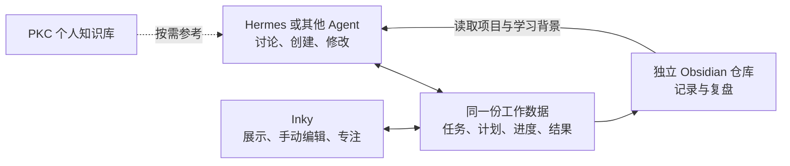

# Inky 现有功能、改造目标与使用方式

> 2026-09-07 实施范围：本步只连接 Inky 自身任务，完全不涉及 PKC 或任何 Obsidian 仓库。已新增主任务编辑、共享保存和 MCP 任务接口；本文其余看板、日志、预计用时等仍为后续规划。实际使用与范围见 [Agent 协作使用说明](../Agent协作使用说明.md)。

日期：2026-09-06。状态：已澄清的产品方案，功能尚未实施。

用户已明确选择：在 Hermes 或其他 Agent 中交流，计划和进度主要呈现在 Inky，Agent 和用户都能修改。

因此 Inky 的目标是一个由对话驱动、也能直接编辑的工作面板。用户在熟悉的 Agent 中讨论目标、安排工作和调整计划；Agent 把明确的操作写入共享工作数据，Inky 展示最新状态并提供专注与手动编辑。用户无需在每个界面重复录入。

本文件更新此前方案：Agent 与 Inky 共同维护任务和计划属于第一版核心需求；此前“仅由 Inky 发起 AI 请求”和“Agent 只读”的设想不再作为主流程。Markdown 复盘仍可单向导出，这与 Agent / Inky 双向编辑任务是两件事。

## 现在的 Inky 有什么

以下根据本次核查的源码 `058d92a`、版本 `0.1.2` 整理。本轮没有启动桌面应用重新验收，不以此判断用户安装版是否与源码相同。

| 已有功能 | 当前如何使用 | 当前边界 |
|---|---|---|
| 任务与子步骤 | 输入任务，选择工作/学习/生活/想法分类；勾选完成；点击拆解入口生成或编辑步骤，保存后逐项完成 | 已保存主任务没有完整的标题、日期、优先级编辑面板；已有“今日任务”实际显示任务列表，未实现真正按日期规划 |
| Inbox | 切换底部 Inbox 输入想法；拖到转任务区并选择分类，或删除；专注时快速记录也进入 Inbox | 尚未对接 Obsidian；不把内部存在的状态字段当作已有完整归档界面 |
| 专注 | 点击任务旁的开始按钮；设置里选择 15/25/45 分钟；可暂停、继续、放弃；计时结束可继续一轮或完成任务 | 当前只允许一个未结束的专注会话；完成计时不等于完成主任务 |
| 记录与恢复提示 | 从任务列表的“记录”查看专注历史与今日汇总；专注中收集想法后提示回到原任务；已有本地会话恢复逻辑 | 尚无项目级“做到哪里、下次先做什么、相关资料”存档，也无成果型日复盘 |
| 桌面与可选 AI | 透明置顶小窗、Alt+F 显示/隐藏、托盘、迷你模式；宠物命名/成长/本地宠物包、心情选择；配置 AI 后做任务解析与拆解；数据本地保存 | 尚未接入 Hermes 或其他 Agent；AI 不是跨项目规划器；常规记录仍有按输入长度进入 AI 的路径 |

当前常用流程：打开 Inky → 输入任务并选分类 → 需要时拆成步骤 → 开始专注 → 临时想法放 Inbox → 完成后查看记录。

## 改造后每天怎样用

下面的对话均为改造后的使用示例，现在还不能操作真实 Inky 数据。

| 场景 | 你在 Hermes / 其他 Agent 中说 | Agent 执行 | Inky 展示与手动操作 |
|---|---|---|---|
| 安排一天 | “今天有两小时，先推进报告，再练习选图，安排进 Inky。” | 读取已有目标和任务，创建/调整当天计划，保存后返回结果 | 今日计划、顺序、预计用时、下一步；可直接改名、改日期、调顺序、改估时 |
| 临时变化 | “下午少了一小时，把学习移到明天，保留报告。” | 修改已有任务的日期和安排，复用原任务 ID | 列表随保存结果更新；可撤销或锁定需要保留的安排 |
| 开始与中断 | “报告先做十分钟；下次从补反例开始。” | 按需要调整下一步，保存恢复线索；明确要求开始时调用专注动作 | 显示当前一步、计时和相关笔记；可以手动开始、暂停、继续、补一句卡点 |
| 收工 | “整理今天的成果和卡点，保存到工作记录。” | 读取最新任务/专注事实与用户补充结果，生成并保存复盘 | 显示完成事项、真实投入、未解决问题和明日起点；摘要可编辑，产出链接可补充 |
| 学习 | “围绕今天不会的地方，安排三次短练习。” | 基于选定材料与真实卡点创建学习目标和练习任务 | 学习计划、下一次练习与反馈；可调整顺序、跳过或记录需要提示的地方 |

不需要所有功能都通过聊天完成。赶时间时，在 Inky 里手动新增、改名、勾选、调顺序、改预计时长都应该直接可用；复杂的目标澄清、拆解、重新安排与复盘适合交给 Agent。

第一次尚无历史记录时，用户只需提供当前目标、可用时间和可选截止日期。Agent 可据此创建第一份计划。之后的执行自然积累为工作学习记录，不要求预先补齐历史日志。

## 两个入口，一份状态

“双方都能修改”指 Agent 和 Inky 操作同一个任务 ID 和最新状态。例如，Agent 创建“练习选图，预计 25 分钟”，用户在 Inky 改成 15 分钟；下次要求 Agent 安排今天时，它先读取最新的 15 分钟，再安排后续工作。

Inky 在写入完成后更新界面。Agent 的历史聊天文本不会自动重写；Agent 下一次读任务、重规划或写入前必须获取最新状态。同步的重点是计划、任务、进度与结果，不是不同 Agent 的聊天历史。

| 用户意图 | 默认行为 |
|---|---|
| “有哪些方案”“先讨论一下” | 返回建议；未明确安排时保持讨论结果 |
| “安排进 Inky”“新增一个任务”“把它改到明天” | 在明确范围内直接执行并返回保存结果；不增加固定的第二次确认 |
| 在 Inky 中直接编辑 | 保存后立即生效，进入同一份工作数据 |
| 撤销刚才的修改 | 按最新版本生成反向修改；后续已有其他改动时只处理可安全撤销的部分 |
| 多个入口同时修改 | 不让旧整份计划覆盖新状态；不冲突的字段可合并，同一字段冲突则保留现状并要求基于新版本处理 |

Agent 回复“已安排”需要工具返回实际保存成功。连接失败或未保存时，应保留草稿并说明状态，不把聊天中的计划文本当成已经写入。

## Inky 的界面分工

默认收起时只留托盘或用户选择的小浮条。呼出后首先展示当前任务、下一步和今日计划；任务标题、日期、预计用时、顺序和状态可以就地修改。

项目/学习详情、资料链接、历史和复盘通过展开进入。宠物、心情和陪伴反馈保留为可选功能。第一版不需要内嵌完整 Agent 聊天界面；日常对话继续使用 Hermes 或其他已接入的 Agent。

需要帮助时，Inky 可以提供“交给 Agent”入口，把选定任务的上下文交出去；这一便利入口可以后置，不应成为从外部 Agent 修改 Inky 的前提。

## 工程上需要补齐什么

这里是拟议实现，不是已存在的连接器。

Hermes 官方支持连接外部 MCP 工具，包括本地 stdio 与 HTTP 服务。因此建议让 Inky 暴露一组可读写工作数据的 MCP 工具，Hermes 作为客户端调用；支持相应 MCP 接入方式的其他 Agent 也可配置使用。不支持 MCP 的 Agent 可另配本地命令入口，是否兼容逐个验证。[Hermes MCP 文档](https://hermes-agent.nousresearch.com/docs/user-guide/features/mcp/)

这与 Inky 调用 Hermes API 的方向不同：主流程变为“外部 Agent 调用 Inky 工作工具”。原有 Hermes API 可以保留为以后在 Inky 内发起建议的可选入口。

| 工作包 | 所需能力 | 完成依据 |
|---|---|---|
| 共享工作数据 | 在 Rust 层建立任务/计划的统一读写动作、稳定 ID、版本校验和变更记录；Inky 与 Agent 共用 | Agent 修改后 Inky 更新，Inky 修改后 Agent 读取到相同状态；重启不丢失 |
| Agent 接口 | 读取今日状态、创建/修改任务、更新计划、保存卡点/成果、查询历史、写复盘等具名工具 | Hermes 真正执行一次创建和修改；再由另一种支持的 Agent 读取及修改同一对象 |
| 完整手动编辑 | 主任务标题、日期、预计用时、优先级、顺序、状态、子步骤、项目链接与恢复线索 | 不经过模型也能完成日常调整；未保存的输入不因外部更新被丢弃 |
| 专注与低打扰 | 已有专注流程接到同一任务状态；托盘优先，隐藏时停止无用动画；保留真实计时 | 同一时刻只有一个有效专注；通过两个入口控制不重复启动；窗口隐藏不丢计时 |
| 工作学习记录 | 从独立 Vault 读取背景，将结果和复盘落到可编辑笔记；来源可追溯 | 重复保存不重复写，用户正文保留；PKC 不成为日常日志目标 |

当前 `FocusFlowWidget.tsx` 在加载后持有完整状态并整份保存；`persistence.rs::save_state` 会删除不在提交快照里的任务。因此不能仅把“直接改 SQLite”的工具交给 Agent：前端下一次保存可能抹掉外部改动。必须先把相关写入改成共享的细粒度动作，或提供真实的版本校验与重读机制；前端本地的保存序号不等于跨入口并发保护。

建议复用 Inky 的 Rust 后端提供共享服务，避免为每个 Agent 启动独立数据库副本。窗口隐藏时服务仍可工作；完全退出后明确显示未连接。是否支持按需启动后台服务在实现时确定，不以虚构的离线写入回执代替实际保存。

新工具只提供具名工作操作，建议生成、任务写入、专注控制和日志导出分别处理。Agent 不需要获得任意文件覆盖能力来修改任务；模型提供商与密钥仍由各 Agent 管理。接口可读写不等于要把已有 Hermes 的所有通用工具改成只读。

## Obsidian 和 PKC 各自的位置

工作学习 Vault 保存项目背景、学习材料、用户笔记与复盘。Inky 的共享工作数据保存可操作的任务、计划、专注状态和修改记录。Markdown 中的任务摘要若暂未支持导入，应清楚标为快照；“在 Obsidian 改任务复选框也同步”属于另一个接口需求，不混入本次 Agent / Inky 双向编辑承诺。

PKC 保存个人知识，只在用户需要方法、概念与背景时检索。日常工作/学习记录和自动复盘仍进入另一个独立仓库。

## 推荐的第一版验收流程

从一个真实目标开始：用户在 Hermes 说“安排进 Inky” → Inky 出现可编辑计划 → 用户在 Inky 改一项预计用时 → Hermes 读取到修改并重新安排 → Inky 开始并结束专注 → Hermes 将成果保存为工作记录。

至少再验证一次重复请求、一次过期版本写入和一次连接中断；避免只有顺利路径能跑通。通过后再扩展学习练习、成长纪念物与更丰富的陪伴。

## 本次核查入口

源码：`src/components/FocusFlowWidget/FocusFlowWidget.tsx`、`src/components/FocusFlowWidget/TaskBreakdownCard.tsx`、`src/types/index.ts`、`src/utils/focusFlowPersistence.ts`、`src-tauri/src/main.rs`、`src-tauri/src/persistence.rs`。本地 Hermes MCP 文档：`C:\Users\31009\Documents\hermes\website\docs\user-guide\features\mcp.md`。

本次交付为功能对照、使用说明与架构更新。Agent 接口、完整手动编辑和双向更新仍待实施。
